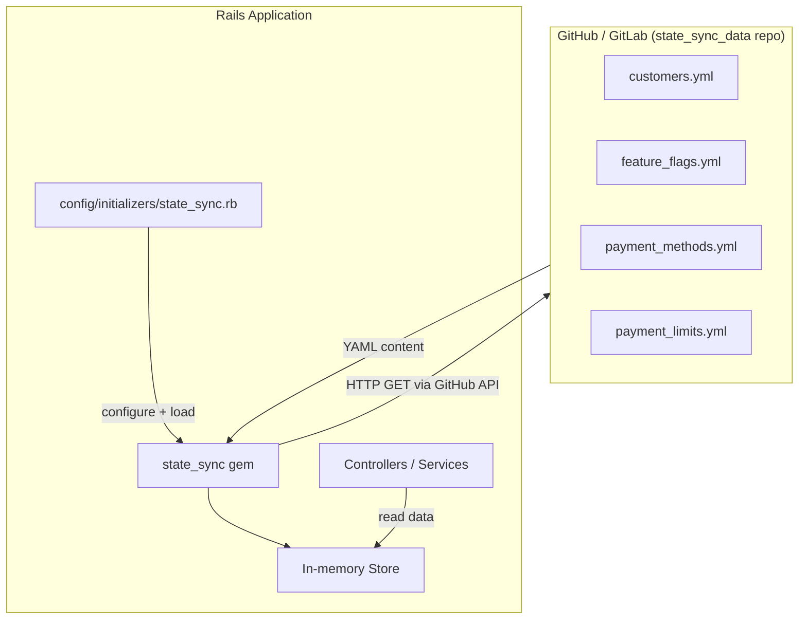
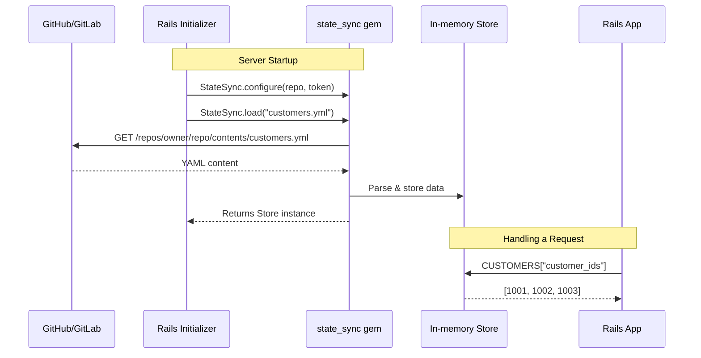

# state_sync Architecture

## How it works

Paste the code blocks below into Confluence using the **Mermaid** macro.

---

## Component Overview

```mermaid
graph TD
    subgraph GitHub["GitHub / GitLab (state_sync_data repo)"]
        F1[customers.yml]
        F2[feature_flags.yml]
        F3[payment_methods.yml]
        F4[payment_limits.yml]
    end

    subgraph RailsApp["Rails Application"]
        I[config/initializers/state_sync.rb]
        GEM[state_sync gem]
        STORE["In-memory Store"]
        APP[Controllers / Services]
    end

    I -->|configure + load| GEM
    GEM -->|HTTP GET via GitHub API| GitHub
    GitHub -->|YAML content| GEM
    GEM --> STORE
    APP -->|read data| STORE
```

---

## Request Flow

```mermaid
sequenceDiagram
    participant GH as GitHub/GitLab
    participant I as Rails Initializer
    participant GEM as state_sync gem
    participant STORE as In-memory Store
    participant APP as Rails App

    Note over I,GEM: Server Startup
    I->>GEM: StateSync.configure(repo, token)
    I->>GEM: StateSync.load("customers.yml")
    GEM->>GH: GET /repos/owner/repo/contents/customers.yml
    GH-->>GEM: YAML content
    GEM->>STORE: Parse & store data
    GEM-->>I: Returns Store instance

    Note over APP,STORE: Handling a Request
    APP->>STORE: CUSTOMERS["customer_ids"]
    STORE-->>APP: [1001, 1002, 1003]
```

---

